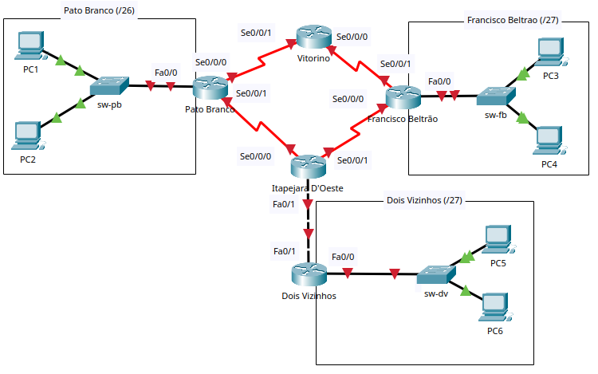

# Trabalho: Integração de habilidades - 2025/2
## Disciplina: Redes de Computadores
### Cursos: Engenharia de Computação / Tecnologia em Análise e Desenvolvimento de Sistemass

## Objetivo

Este trabalho prático tem como objetivo proporcionar aos alunos a aplicação dos conceitos de redes de computadores por meio do desenvolvimento de uma topologia de rede que simula um cenário real de interligação de campi e serviços de infraestrutura.

Ao concluir esta atividade, você será capaz de demonstrar que obteve as seguintes habilidades:

  * **Projetar a Rede Lógica:** Aplicar **VLSM em IPv4** e sub-redes em **IPv6** para criar um esquema de endereçamento eficiente para a topologia.
  * **Configurar Serviços de Rede:** Implementar e integrar serviços essenciais de infraestrutura (**DHCP, DNS e HTTP**) em uma arquitetura distribuída.
  * **Definir e Implementar Rotas:** Criar e configurar **rotas estáticas** para viabilizar a comunicação entre redes remotas, utilizando fluxo assimétrico em IPv4 e IPv6.
  * **Configurar Topologia:** Configurar roteadores, switches e dispositivos finais (servidores/PCs) utilizando **interface de linha de comando (CLI)**.
  * **Verificar a Conectividade:** Garantir a comunicação plena entre todos os elementos da rede, validando a conectividade em IPv4, IPv6 e a **resolução de nomes de domínio (DNS)**.
  * **Definir e Implementar Segurança:** Configurar e validar **medidas básicas de segurança** e acesso remoto seguro (SSH) nos equipamentos intermediários.
  * **Documentar a Rede:** Realizar a documentação completa do projeto de rede.

## Descrição da Atividade e Topologia

Neste trabalho, você deverá projetar e implementar uma topologia de rede que interliga centros de pesquisa associados aos campi da UTFPR localizados na região sudoeste do Paraná, nas cidades de Pato Branco, Francisco Beltrão e Dois Vizinhos. A topologia a ser utilizada como referência está apresentada na [Figura 1](#figura1). 

Durante o desenvolvimento da atividade, será necessário realizar o planejamento da rede, configurar os equipamentos de interconexão (roteadores e switches), além dos dispositivos finais, e assegurar que todos os centros estejam corretamente interligados, com roteamento funcional tanto em IPv4 quanto em IPv6. Além disso, cada campus deverá ter sua própria infraestrutura de serviços, conforme apresentado no [Quadro 1](#quadro-1-infraestrutura-de-serviços-por-campus):

#### **Quadro 1: Infraestrutura de Serviços por Campus**
| Campus | Servidor DNS/DHCP | Servidor Web | Subdomínio |
| :--- | :--- | :--- | :--- |
| **Pato Branco** | `SRV-PB-DNS-DHCP` | `SRV-PB-WEB` | `www.pb.utfpr.tec.br` |
| **Francisco Beltrão** | `SRV-FB-DNS-DHCP` | `SRV-FB-WEB` | `www.fb.utfpr.tec.br` |
| **Dois Vizinhos** | `SRV-DV-DNS-DHCP` | `SRV-DV-WEB` | `www.dv.utfpr.tec.br` |

A entrega deste trabalho deverá contemplar a documentação detalhada do projeto de rede e a topologia configurada e funcional no Packet Tracer.

-----

## 📑 Tarefa 1: Projetar e Documentar as Sub-redes (0,5 Ponto)

Utilize o bloco de endereços **IPv4 200.136.N.0/24** e **IPv6 2001:DB8:CAFE:NN00::/56** (em que **N** e **NN** são os dois últimos dígitos do seu RA) para criar as sub-redes, de acordo com as seguintes especificações:

1.  **Prefixos IPv4:** /26 para Pato Branco, /27 para Francisco Beltrão/Dois Vizinhos e futuros centros, /30 para enlaces WAN.
    - Deve-se prever a expansão da rede com três novos centros de pesquisa, localizados na região oeste do Paraná, nas cidades de Toledo, Medianeira e Santa Helena, as sub-redes para esses três centros deve utilizar o prefixo **/27**.
2.  **Prefixos IPv6:** /64 para todas as LANs, /112 para enlaces WAN.
3.  **Alocação das sub-redes para LANs:**
    - Utilize a **primeira sub-rede** para a LAN de **Pato Branco**.
    - Utilize a **segunda sub-rede** para a LAN de **Francisco Beltrão**.
    - Utilize a **terceira sub-rede** para a LAN de **Dois Vizinhos**.
    - Reserve a **quarta, quinta e sexta sub-redes** para os futuros centros de pesquisa que estão em implantação na região oeste do estado
4.  **Alocação das sub-redes para WANs:**
    - No IPv4, utilize a **última sub-rede /27 disponível** para subdividir em blocos **/30**, destinados aos enlaces entre roteadores (**pb-vit, vit-fb, fb-ita, ita-pb, ita-dv**, e também os enlaces para os novos centros de pesquisa).
    - No IPv6, utilize a **última sub-rede /64 disponível** para subdividir em blocos **/112**, destinados aos mesmos enlaces entre roteadores.

> 💡 **Dica:** Você pode incluir as informações de sub-redes diretamente na topologia (no Packet Tracer) para facilitar a visualização e organização do projeto.

  * **Documentar** todas as sub-redes (IPv4 e IPv6) conforme o [modelo](trabalho-documentacao-modelo.md).

-----

## 🖥️ Tarefa 2: Plano de Endereçamento Lógico (Documentação) (0,5 Ponto)

Esta tarefa exige a documentação completa do esquema de endereçamento lógico, definindo os endereços IPv4 e IPv6 (Global Unicast Address-GUA e Link-Local) para a infraestrutura e o uso do DHCP para os clientes (PCs).

### 2.1. Endereçamento Estático (LANs e WANs)

Os endereços IPv4 e os endereços IPv6 GUA devem ser atribuídos manualmente aos dispositivos de infraestrutura (roteadores, switches e servidores), seguindo a ordem de host válido da respectiva sub-rede.

#### A. Endereçamento nas LANs (Pato Branco, Francisco Beltrão e Dois Vizinhos)

Em cada LAN, os **quatro primeiros** endereços de host válidos são reservados para a infraestrutura de serviços conforme descrito no [**Quadro 2**](#quadro-2-regras-de-endereçamento-estático-fixo-nas-lans):

#### **Quadro 2: Regras de Endereçamento Estático Fixo nas LANs**

| Endereço de Host Válido | Dispositivo e Função | Endereçamento (Manual/Estático) |
| :--- | :--- | :--- |
| **Primeiro** | Interface **Fa0/0 do Roteador** (Default Gateway) | IPv4 e IPv6 GUA |
| **Segundo** | **SVI do Switch** (Gerenciamento) | IPv4 e IPv6 GUA |
| **Terceiro** | Servidor **DHCP/DNS** | IPv4 e IPv6 GUA |
| **Quarto** | Servidor **Web** | IPv4 e IPv6 GUA |

#### B. Endereçamento nos Enlaces WAN (Seriais e Fa0/1)

  * **Interfaces Seriais (Se0/0/0 e Se0/0/1):**
      * A interface **Se0/0/0** de cada roteador (que será a **DCE**,  com clock rate de **56000**) usará o **primeiro endereço de host válido** para **IPv4** e o **primeiro GUA** para **IPv6**
      * A interface **Se0/0/1** de cada roteador usará o **segundo endereço de host válido** para **IPv4** e o **segundo GUA** para **IPv6**.
  * **Enlaces Assíncronos (Itapejara D'Oeste - Dois Vizinhos):**
      * Interface **Fa0/1** do roteador **Itapejara D’Oeste** usará o **primeiro** endereço de host válido (IPv4 e IPv6 GUA) da sub-rede.
      * Interface **Fa0/1** do roteador **Dois Vizinhos** usará o **segundo** endereço de host válido (IPv4 e IPv6 GUA) da sub-rede.

### 2.2. Endereçamento Dinâmico para Clientes (DHCP)

Os computadores (**PCs**) não receberão endereços estáticos, isto é, devem ser configurados para obter todo o seu endereçamento **automaticamente via DHCPv4** e **SLAAC/DHCPv6 stateless** (para IPv6).

### 2.3. Regras de Endereçamento Link-Local (IPv6)

O endereçamento **Link-Local (`FE80::/10`)** deve seguir as seguintes regras específicas:

  * **Interfaces LAN (Fa0/0) dos Roteadores:** O endereço de Link-Local deve ser especificado **manualmente** como **`FE80::1`**.
  * **Interfaces WAN (Seriais/Fa0/1) dos Roteadores:** O endereço de Link-Local deve ser configurado automaticamente via **EUI-64**.
  * **Computadores (PCs) e Servidores:** Os endereços de Link-Local devem ser configurados automaticamente via **EUI-64**.

### 2.4. Detalhamento do Endereçamento IPv6 (Requisito de Gateway)
Ao documentar o endereçamento dos PCs, Servidores e Switches, o **Default Gateway IPv6** deve ser especificado como o endereço Link-Local do roteador: **`FE80::1`**.

-----

  * **Documentar** o endereçamento estático completo (IPv4/IPv6, máscaras/prefixos e Endereço Link-Local) de **TODOS** os dispositivos (Roteadores, Switches, Servidores) conforme o [modelo](trabalho-documentacao-modelo.md).

Perdão, Professor. Você está absolutamente certo. Houve um erro na minha numeração interna ao tratar a Tarefa 3, que no seu plano original era a documentação do roteamento.

Vou corrigir o fluxo. A próxima etapa deve ser a **Tarefa 3: Documentar as Tabelas de Roteamento**.

Aqui está o detalhamento dessa tarefa, garantindo que o fluxo assimétrico seja documentado tanto para IPv4 quanto para IPv6.

-----

## 🗺️ Tarefa 3: Roteamento Estático (Tabelas - Documentação) (0,5 Ponto)

Esta tarefa consiste em definir e documentar as rotas estáticas necessárias em **TODOS** os roteadores para garantir a conectividade entre as LANs.

1.  **Definir o Fluxo Assimétrico:**
    O fluxo de pacotes deve ser definido de forma que os computadores de **Pato Branco** alcancem os computadores dos centros de pesquisa no **sentido horário**, ou seja, através da rota:

    **Pato Branco $\rightarrow$ Vitorino $\rightarrow$ Francisco Beltrão**

    e as respostas sejam enviadas pelo caminho oposto:

    **Francisco Beltrão $\rightarrow$ Itapejara D’Oeste $\rightarrow$ Pato Branco**.

    Isto é, o fluxo de ida deve ser feito via Vitorino e as respostas pelo caminho via Itapejara D’Oeste.

2.  **Documentar as Tabelas de Roteamento** para IPv4 e IPv6 conforme o [modelo](trabalho-documentacao-modelo.md).

    Para cada roteador, documente as rotas estáticas necessárias, especificando a **Rede Remota (IPv4 e IPv6 GUA)** e o **Endereço do Próximo Salto (Next Hop)**.
      - Não é obrigatório documentar as redes diretamente conectadas.

## 💻 Tarefa 4: Criação da Topologia no Packet Tracer (0 Pontos)
Criar a topologia no Packet Tracer**, conforme ilustrado na [Figura 1](#figura1):
  - Utilize *roteadores modelo 2811* (adicione uma interface WIC-2T no slot 0 para as conexões WAN) e *switches modelo 2960*, equipamentos disponíveis no laboratório de redes;
  - Na área de trabalho de cada topologia, informe o **RA + Nome do aluno**;
  - Recomenda-se inserir as informações de endereçamento na área de trabalho do Packet Tracer para facilitar a visualização.

## 💻 Tarefa 5: Configuração de Serviços e Endereçamento de Servidores (1,5 Pontos)

Esta tarefa exige que você configure o endereçamento estático dos Servidores de Serviços e, em seguida, configure os serviços DHCP, DNS e Web.

### 5.1. Configuração do Endereçamento Estático nos Servidores

Atribua manualmente os endereços IPv4 e IPv6 aos Servidores no Packet Tracer (Desktop $\rightarrow$ IP Configuration), utilizando as regras de endereçamento fixo definidas no [Quadro 1](#quadro-1-infraestrutura-de-serviços-por-campus):

* **Configuração Específica:**
    * **Servidores DNS/DHCP (3º IP Válido):** O Servidor DNS (IPv4) a ser configurado é o seu próprio IP (Terceiro IP da LAN).
    * **Gateways:** Configure o Default Gateway IPv4 (Primeiro IP da LAN) e o Gateway Padrão IPv6 (`FE80::1`).

### 5.2. Configuração do Serviço DHCP e IPv6 (0,5 Ponto)

1.  **Serviço DHCPv4:**
    * Configure o pool: **Default Gateway** (Primeiro IP), **DNS Server** (Terceiro IP).
    * **Start IP Address:** O pool deve iniciar no **sexto endereço de host válido** (reservando o Quinto IP para uso futuro).
2.  **Serviço IPv6 (SLAAC e DNS):**
    * Configure os clientes IPv6 (PCs) para usarem **SLAAC** para auto-configuração do endereço GUA.
    * Use o serviço **DHCPv6 stateless** do servidor *apenas para fornecer o endereço do Servidor DNS IPv6*.

### 5.3. Configuração do Serviço Web (Nos Servidores Web) (0,5 Ponto)

* Ative o serviço **HTTP** e substitua o arquivo `index.html` com o código HTML fornecido (Anexo A), personalizando o **Nome, RA e o Campus** correto.

### 5.4. Configuração do Serviço DNS (Nos Servidores DNS/DHCP) (0,5 Ponto)

Ative o serviço **DNS** e configure o registro Tipo A e Tipo AAAA em cada um dos três servidores DNS para todos os servidores WEB, conforme o [**Quadro 3**](#quadro-3-arquitetura-de-serviços-por-campus-subdomínios-e-ips), garantindo que a resolução de nomes de campi remotos funcione.

#### **Quadro 3: Arquitetura de Serviços por Campus (Subdomínios e IPs)**

| Campus | Subdomínio | Servidor Web (IP GUA de Destino) |
| :--- | :--- | :--- |
| **Pato Branco** | `www.pb.utfpr.tec.br` | IPv4 e IPv6 GUA do SRV-PB-WEB (4º IP de PB) |
| **Francisco Beltrão** | `www.fb.utfpr.tec.br` | IPv4 e IPv6 GUA do SRV-FB-WEB (4º IP de FB) |
| **Dois Vizinhos** | `www.dv.utfpr.tec.br` | IPv4 e IPv6 GUA do SRV-DV-WEB (4º IP de DV) |

## Avaliação
* A atividade é individual, porém, poderá ser feita em grupo! 
* Entrega 1 - Entregar, via moodle, arquivo conforme o [modelo](trabalho-documentacao-modelo.md), nomeado como trabalho-documentacao-NomeAluno.md, em formato .md, conforme o modelo disponibilizado contendo:
    * RA e Nome do aluno;
    * Documentação correspondente as Tarefas 1 e 2;
    * Data da entrega: até às **13h** do dia **28/10/2025**
        * Não será aceita entrega após o prazo;
        * Obs: no dia **28/10/2025, após às 13h**, será disponibilizado o gabarito para conferência e correções caso necessário;
* Entrega 2 - Entrega, via moodle, arquivo [modelo](trabalho-documentacao-modelo.md), contendo a resolução da *Tarefa 1 e 2 (corrigidas)* e da Tarefa 3.
    * Data da entrega: até às **13h** do dia **04/10/2025**
        * Não será aceita entrega após o prazo;
        * Obs: no dia **04/10/2025, , após às 13h**, será disponibilizado o gabarito para conferência e correções caso necessário;
* Entrega 3 – Entrega, via moodle, arquivo compactado nomeado trabalho-nomealuno.zip, contendo:
	 * arquivo com a documentação da Entrega 1, corrigida, se for o caso;
	 * arquivo em formato .pkt (Packet Tracer), nomeado como trabalho-topologia-NomeAluno.pkt com a topologia configurada e funcionando no Packet Tracer (Tarefas 4 a 7).
	    * Data da entrega: *a definir... (antes da prova)*;
            * Não será aceita entrega após o prazo;
